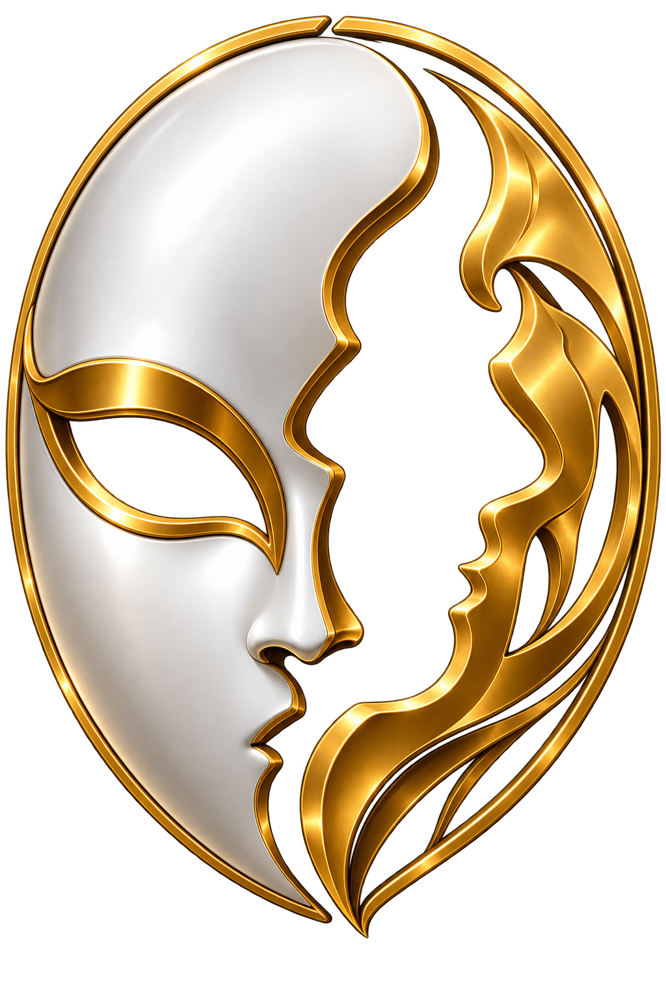

<p align="center">
  
</p>

# Project LOKI

Avatar animado que coloca a Galateia no desktop com movimentos, reações e uma interface de conversa ao redor da personagem.

## Recursos principais

- mais de 72 clipes de animação;
- movimentos autônomos e poses na barra de tarefas;
- arraste, mudança de escala e suporte a vários monitores;
- menu de ações e roda de gestos;
- skins, roupas, expressões, poses e diferentes aparências;
- menus e elementos visuais inspirados em Sword Art Online;
- conversa por balões e painel completo para textos longos;
- execução em processo separado.

## Origem do nome

LOKI vem de Loki, figura da mitologia nórdica conhecida pela astúcia, metamorfose e mudança de forma. Nas histórias, Loki assume diferentes aparências e espécies para se adaptar a cada situação. Essa característica combina com um projeto que controla como uma personagem aparece, se move e se transforma no desktop.

### Identidade visual

A logo é uma máscara formada por duas faces complementares. A face branca e prateada é lisa e sólida; a face dourada usa curvas e espaços vazios. As duas pertencem ao mesmo objeto, embora assumam formas diferentes.

A máscara representa avatar e aparência, enquanto a assimetria representa transformação. A ideia central é **uma identidade capaz de assumir diferentes formas**. A silhueta das duas faces dentro do oval permanece clara mesmo em tamanho pequeno.

## Requisitos

- Windows;
- Python 3.11 ou mais recente;
- PySide6 e as dependências descritas em `pyproject.toml`.

## Instalação e uso

```powershell
uv venv
uv pip install -e .
python -m mascot.process_main
```

Sem um canal de comunicação configurado, o LOKI abre em modo de demonstração para testar animações. `iniciar_loki_oculto.vbs` abre sem terminal visível e `criar_atalho_desktop.vbs` cria um atalho na área de trabalho.

As configurações e a posição ficam em `data/mascot_config.json` e `data/mascot_posicao.json`.

## Testes

```powershell
$env:QT_QPA_PLATFORM = "offscreen"
python testes/testar_mascot_assets.py
```

Os arquivos `testes/testar_mascot_*.py` podem ser executados separadamente.

## Integrações com outros projetos

- **GAIA:** mantém a identidade da Galateia, enquanto o LOKI controla a forma visual usada para apresentá-la no desktop. A integração também envia mensagens, estados de voz, comandos de animação e ajustes do avatar pelo canal local.

O modo de demonstração permite revisar a parte visual sem iniciar a GAIA.

## Documentação

- [Arquitetura](docs/ARQUITETURA.md)
- [Guia de animações](docs/ANIMACOES_GALATEIA.md)
- [Pendências](docs/TODO.md)
- [Histórico de versões](CHANGELOG.md)
- [Padrão de documentação](docs/PADRAO_DOCUMENTACAO.md)

## Situação atual

O avatar, os comportamentos, o menu de ações e a conversa por balões estão em uso.
